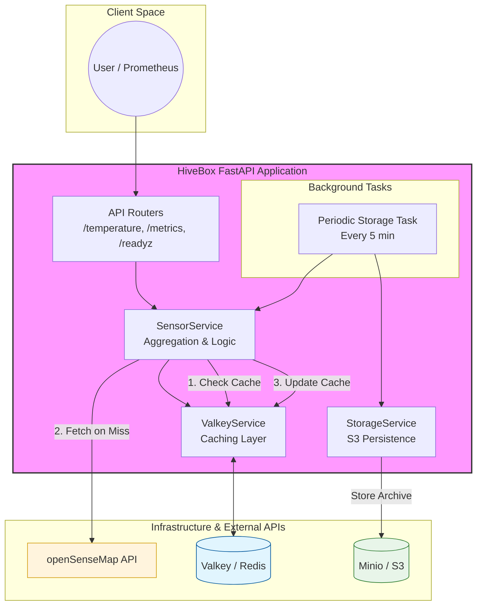

# HiveBox

HiveBox est une application FastAPI conçue pour agréger et surveiller les données de température provenant de plusieurs capteurs via l'API OpenSenseMap. Elle expose des métriques au format Prometheus pour une intégration facile avec les outils de monitoring.

## Fonctionnalités

- **Agrégation de Température** : Calcule la moyenne des températures de plusieurs boîtiers configurés.
- **Monitoring Prometheus** : Expose des métriques détaillées (requêtes, températures actuelles, statuts).
- **Health Checks** : Endpoints dédiés pour vérifier la version et la santé de l'application.
- **Cloud Native** : Prête pour Kubernetes avec configuration Ingress et sondes de disponibilité.

## Architecture & Normes

L'application suit les standards modernes de développement Python :
- **Framework** : FastAPI (Asynchrone, performant).
- **Normes de Code** : Strict respect de la PEP 8 via flake8.
- **Type Hinting** : Utilisation systématique des types Python pour une meilleure maintenabilité.
- **Monitoring** : Standards Prometheus via prometheus_client.

### Métriques Métier Personnalisées
- `hivebox_healthy_boxes_total` (Gauge) : Nombre de senseBoxes actuellement joignables.
- `hivebox_cache_miss_total` (Counter) : Nombre total de récupérations de données via l'API externe dues à une absence ou expiration du cache.

## Architecture Système



## Structure du Projet

```text
hivebox/
├── src/app/
│   ├── main.py
│   ├── routes/      # Endpoints API
│   └── services/    # Logique métier (Valkey, S3, SenseMap)
├── infra/           # Configuration Kustomize (Valkey, Minio)
├── k8s/             # Manifestes Kubernetes
├── charts/          # Helm Charts
├── tests/           # Tests unitaires et intégration
└── Dockerfile
```

## Tests & Validation

La qualité du code est assurée par une suite de tests complète utilisant pytest.

### Exécution des tests
```bash
uv run pytest
```

- **Tests Unitaires** : Vérifient la logique de calcul, les statuts Prometheus et les formats de réponse.
- **Tests d'Intégration** : Utilisent TestClient pour valider les interactions entre les composants sans dépendances externes complexes.
- **Linting** : flake8 est utilisé pour garantir la propreté du code.

## CI/CD (GitHub Actions)

Plusieurs workflows sont en place pour assurer la stabilité du projet :
- **Lint** : Vérifie le style du code Python et du Dockerfile.
- **Tests** : Exécute la suite pytest sur chaque PR.
- **Build** : Valide la création de l'image Docker.
- **SonarQube** : Analyse de la qualité du code et respect des normes de sécurité associées.
- **Scorecard** : Analyse de sécurité OpenSSF.
- **Terrascan** : Scan de sécurité des fichiers d'infrastructure.

## Docker

L'application est containerisée pour garantir un environnement d'exécution reproductible.

### Construction de l'image locale
```bash
docker build -t hivebox:local .
```

### Exécution du conteneur
```bash
docker run -p 8000:8000 \
  -e BASE_URL="https://api.opensensemap.org" \
  -e BOX_ID="votre_box_id" \
  hivebox:local
```

### Registre d'images
Les images sont automatiquement construites et publiées sur GitHub Container Registry (GHCR) lors des push sur la branche principale ou la création de tags :
`ghcr.io/votre-utilisateur/hivebox:latest`

## Kubernetes

L'application est configurée pour être déployée sur un cluster Kubernetes (testé avec KIND).

### Déploiement local avec KIND

1. **Créer le cluster** :
   ```bash
   kind create cluster --config k8s/kind-config.yaml
   ```

2. **Charger l'image locale** :
   ```bash
   kind load docker-image hivebox:local
   ```

3. **Appliquer les manifestes** :
   ```bash
   kubectl apply -f k8s/deployment.yaml
   kubectl apply -f k8s/service.yaml
   kubectl apply -f k8s/ingress.yaml
   ```

### Configuration
Les fichiers se trouvent dans k8s/ :
- `deployment.yaml` : Gère les réplicas, les ressources (CPU/RAM) et les variables d'environnement (BASE_URL, BOX_ID).
- `service.yaml` : Expose l'application en interne.
- `ingress.yaml` : Permet l'accès externe via un contrôleur Ingress.

### Variables d'Environnement Clés
- `BASE_URL` : URL de l'API OpenSenseMap.
- `BOX_ID` : Liste des IDs de boîtiers séparés par des virgules.

## Installation Locale

1. Installer uv si nécessaire : `curl -LsSf https://astral.sh/uv/install.sh | sh`
2. Installer les dépendances : `uv sync --dev`
3. Lancer l'app : `uv run uvicorn src.app.main:app --reload tps://astral.sh/uv/install.sh | sh`
2. Installer les dépendances : `uv sync --dev`
3. Lancer l'app : `uv run uvicorn src.app.main:app --reload`
