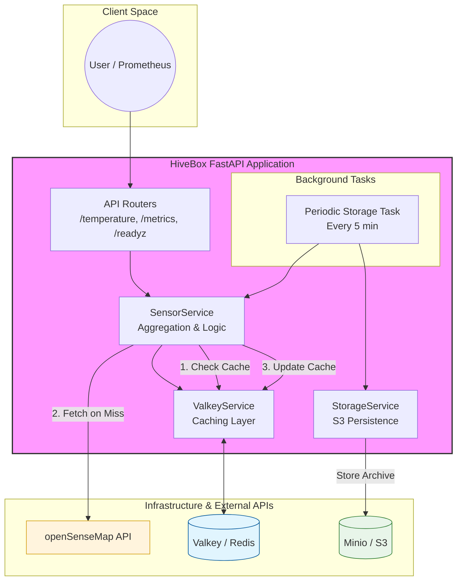
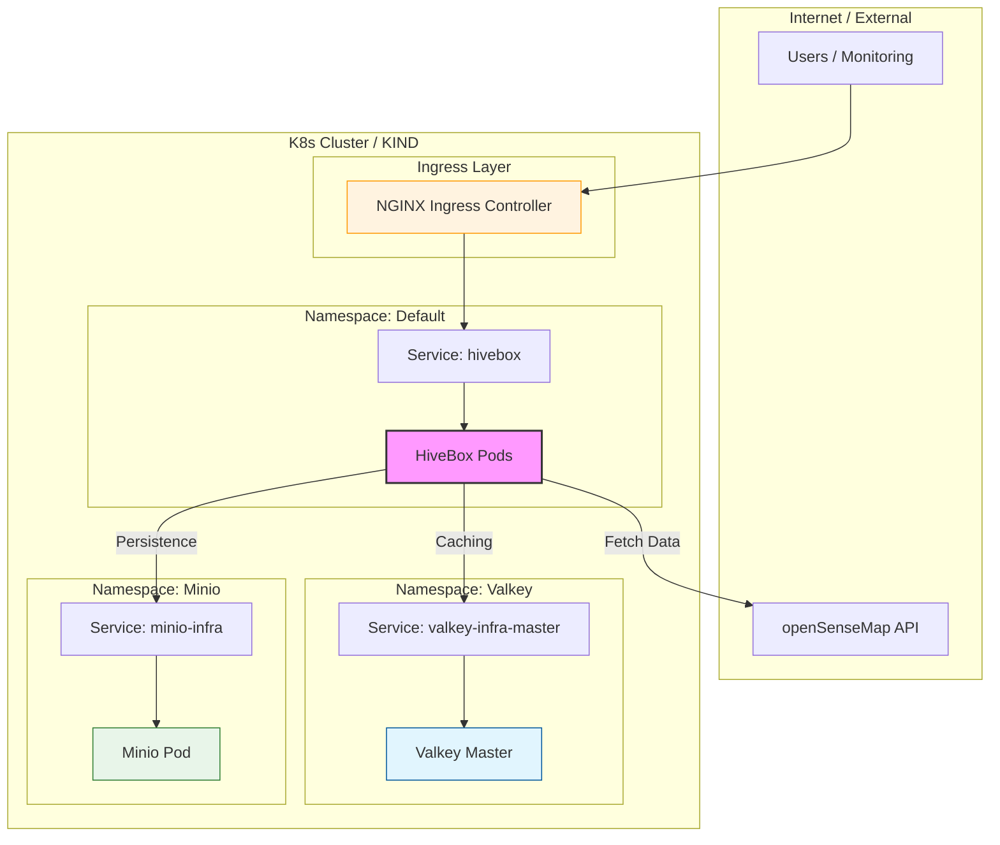

# HiveBox

> Pour le déploiement complet de la stack, voir [DEPLOYMENT.md](DEPLOYMENT.md).

HiveBox est une application FastAPI conçue pour agréger et surveiller les données de température provenant de plusieurs capteurs via l'API OpenSenseMap. Elle expose des métriques au format Prometheus pour une intégration facile avec les outils de monitoring.

## Fonctionnalités

- **Agrégation de Température** : Calcule la moyenne des températures de plusieurs boîtiers configurés.
- **Cache Multi-niveaux** : Intégration de Valkey (Redis-compatible) pour réduire les appels API, avec un fallback automatique sur un cache mémoire.
- **Stockage Persistant** : Sauvegarde périodique des données sur un stockage compatible S3 (Minio).
- **Monitoring Prometheus** : Expose des métriques détaillées (requêtes, températures actuelles, statuts, hits/miss de cache).
- **Health Checks** : Endpoints dédiés pour vérifier la version et la santé de l'application (incluant la validation du cache).
- **Cloud Native** : Prête pour Kubernetes avec configuration Ingress, sondes de disponibilité et gestion de l'infrastructure via Kustomize/Helm.

## Architecture & Normes

L'application suit les standards modernes de développement Python :
- **Framework** : FastAPI (Asynchrone, performant).
- **Normes de Code** : Strict respect de la PEP 8 via flake8.
- **Type Hinting** : Utilisation systématique des types Python pour une meilleure maintenabilité.
- **Monitoring** : Standards Prometheus via prometheus_client.

### Métriques Métier Personnalisées
- `hivebox_healthy_boxes_total` (Gauge) : Nombre de senseBoxes actuellement joignables.
- `hivebox_cache_miss_total` (Counter) : Nombre total de récupérations de données via l'API externe dues à une absence ou expiration du cache.

## Architecture Système



## Architecture de Déploiement (Kubernetes)



## Structure du Projet

```text
hivebox/
├── src/app/
│   ├── main.py
│   ├── routes/      # Endpoints API
│   └── services/    # Logique métier (Valkey, S3, SenseMap)
├── infra/           # Configuration Kustomize (Valkey, Minio)
├── k8s/             # Manifestes Kubernetes
├── charts/          # Helm Charts
├── tests/           # Tests unitaires et intégration
└── Dockerfile
```

## Tests & Validation

La qualité du code est assurée par une suite de tests complète utilisant pytest.

### Exécution des tests
```bash
# Lancer tous les tests (unitaires + intégration)
uv run pytest

# Lancer les tests E2E avec Venom (nécessite une instance qui tourne)
venom run tests/e2e/hivebox.yml --var base_url=http://localhost:8000
```

- **Tests Unitaires** : Vérifient la logique de calcul, les statuts Prometheus et les formats de réponse.
- **Tests d'Intégration** : Utilisent TestClient pour valider les interactions entre les composants sans dépendances externes complexes.
- **Tests E2E (Venom)** : Valident le cycle de vie complet de l'application déployée sur Kubernetes, incluant les interactions réelles avec Valkey et MinIO.
- **Linting** : flake8 est utilisé pour garantir la propreté du code.

## CI/CD (GitHub Actions)

Plusieurs workflows sont en place pour assurer la stabilité du projet :

| Workflow | Fichier | Déclencheur | Description |
|---|---|---|---|
| Lint | `lint.yml` | push, PR | Vérification du style Python (`flake8`) et du Dockerfile (`hadolint`) |
| Tests unitaires & intégration | `tests.yml` | push, PR | Suite `pytest` complète |
| Tests d'intégration | `integration-tests.yml` | push, PR | Tests d'intégration avec dépendances réelles |
| Tests E2E | `e2e-tests.yml` | push `main` | Tests Venom sur cluster KIND |
| Build | `build.yml` | push `main`, tags | Build et push de l'image sur GHCR |
| Pipeline principal | `main.yml` | push `main` | Orchestration du pipeline complet |
| SonarQube | *(main.yml)* | push `main` | Analyse qualité et sécurité du code (SAST) |
| Terrascan | `terrascan.yml` | push, PR | Scan de sécurité des manifestes d'infrastructure |
| OpenSSF Scorecard | `scorecard.yml` | hebdomadaire | Audit de sécurité de la supply chain |

> **Semgrep** est intégré directement via l'application web Semgrep Cloud pour l'analyse statique continue du dépôt.

## Pratiques DevOps & CD (Best Practices)

Le projet intègre les meilleures pratiques de l'industrie pour garantir une livraison continue (CD) robuste et sécurisée :

- **Immuabilité des Artefacts** : Les images Docker sont construites une seule fois et taguées de manière unique (SHA du commit, Tags Git). Ces mêmes images sont utilisées pour toutes les étapes de validation (tests d'intégration, smoke tests).
- **Pipeline de Validation Multi-niveaux** :
  - **Linting** : Vérification rigoureuse du style de code (`flake8`) et de la conformité du Dockerfile (`hadolint`).
  - **Tests Automatisés** : Exécution de tests unitaires et d'intégration via `pytest` à chaque changement.
  - **Smoke Tests** : Validation post-build du démarrage effectif du conteneur et du endpoint `/version`.
- **Sécurité DevSecOps** :
  - **Analyse Statique (SAST)** : Utilisation de SonarQube pour identifier les vulnérabilités et la dette technique.
  - **Supply Chain Security** : Intégration de **OpenSSF Scorecard** pour surveiller la sécurité du dépôt et des dépendances.
  - **Infrastructure Security** : Scan des manifestes Kubernetes via **Terrascan** pour détecter les erreurs de configuration.
- **Gestion des Dépendances** : Utilisation de `uv` pour garantir des environnements de build reproductibles et ultra-rapides via `uv.lock`.
- **Infrastructure as Code (IaC)** : Définition de l'infrastructure via Kustomize et Helm, permettant un déploiement versionné et auditable.
- **Observabilité & Santé** : Implémentation native de métriques Prometheus et de health checks avancés (Sondes K8s).

## Observabilité

### Métriques Prometheus

L'endpoint `/metrics` expose les métriques au format Prometheus. La collecte et la transmission vers Grafana Cloud sont assurées par **Grafana Alloy**, déployé dans le cluster Kubernetes.

Alloy scrape `/metrics` toutes les 30 secondes et pousse les données vers Prometheus Remote Write, et collecte également les logs des pods via Loki.

Configuration : [`k8s/grafana-alloy/values.yaml`](k8s/grafana-alloy/values.yaml)

### Dashboard Grafana

Un dashboard préconstruit est disponible dans [`k8s/grafana-dashboard.json`](k8s/grafana-dashboard.json).

**Import** : Grafana → Dashboards → Import → uploader le fichier JSON → sélectionner la datasource Prometheus.

Il couvre :
- Vue d'ensemble : état du service, capteurs actifs, température moyenne, trafic, cache miss
- Température par capteur (courbes, jauge, histogramme de distribution)
- Trafic API par endpoint (req/s, répartition, totaux)
- Cache Valkey : évolution des miss, taux de hit estimé
- Santé des capteurs : disponibilité et statut dans le temps

## Docker

L'application est containerisée pour garantir un environnement d'exécution reproductible.

### Construction de l'image locale
```bash
docker build -t hivebox:local .
```

### Exécution du conteneur
```bash
docker run -p 8000:8000 \
  -e BASE_URL="https://api.opensensemap.org" \
  -e BOX_ID="votre_box_id" \
  hivebox:local
```

### Registre d'images
Les images sont automatiquement construites et publiées sur GitHub Container Registry (GHCR) lors des push sur la branche principale ou la création de tags :
`ghcr.io/votre-utilisateur/hivebox:latest`

## Kubernetes

L'application est configurée pour être déployée sur un cluster Kubernetes (testé avec KIND).

### Procédure de Déploiement Complet

Suivez ces étapes pour déployer l'intégralité de la stack (Infrastructure + Application) sur un cluster local.

#### 1. Création du Cluster KIND
```bash
kind create cluster --config k8s/kind-config.yaml
```

#### 2. Déploiement de l'Infrastructure (Valkey & MinIO)
Utilise Kustomize avec le support Helm pour installer les dépendances :
```bash
kubectl apply -k infra/base

# Attendre que les pods soient prêts
kubectl wait --for=condition=ready pod -l app.kubernetes.io/name=redis -n valkey --timeout=120s
kubectl wait --for=condition=ready pod -l app.kubernetes.io/name=minio -n minio --timeout=120s
```

#### 3. Configuration des Secrets
Les credentials MinIO sont définis directement dans `k8s/deployment.yaml` via des variables d'environnement. Si vous souhaitez les externaliser dans un Secret Kubernetes :
```bash
kubectl create secret generic hivebox-minio-secret \
  --from-literal=MINIO_ACCESS_KEY=minioadmin \
  --from-literal=MINIO_SECRET_KEY=minioadmin
```

#### 4. Déploiement de HiveBox
Chargez l'image locale dans KIND ou utilisez l'image du registre :
```bash
# Optionnel : Charger une image construite localement
docker build -t hivebox:local .
kind load docker-image hivebox:local

# Appliquer les manifestes
kubectl apply -f k8s/deployment.yaml
kubectl apply -f k8s/service.yaml
kubectl apply -f k8s/ingress.yaml

# Attendre que l'application soit disponible
kubectl wait --for=condition=available deployment/hivebox-deployment --timeout=120s
```

#### 5. Accès à l'Application
L'application est accessible via l'Ingress (nécessite une configuration `/etc/hosts` pour `hivebox.local`) ou via port-forward :
```bash
kubectl port-forward service/hivebox-service 8000:80
```
Accédez ensuite à : `http://localhost:8000/temperature`

### Configuration Kubernetes
Les fichiers se trouvent dans k8s/ :
- `deployment.yaml` : Gère les réplicas, les ressources (CPU/RAM), le contexte de sécurité (non-root, read-only filesystem, seccomp, AppArmor, drop ALL capabilities) et les variables d'environnement.
- `secret.yaml` : Gère les identifiants sensibles (MinIO).
- `service.yaml` : Expose l'application en interne.
- `ingress.yaml` : Permet l'accès externe via `hivebox.local` (TLS activé, redirection HTTP→HTTPS forcée).

## Guide de Démarrage (Développement)

### 1. Prérequis
- [Python 3.13+](https://www.python.org/)
- [uv](https://astral.sh/uv/) (Gestionnaire de paquets ultra-rapide)
- [Docker](https://www.docker.com/) & [KIND](https://kind.sigs.k8s.io/) (pour l'infrastructure locale)

### 2. Installation Locale

```bash
# Cloner le dépôt
git clone <url-du-repo>
cd hivebox

# Installer les dépendances
uv sync --dev
```

### 3. Configuration de l'Environnement (.env)
Créez un fichier `.env` à la racine pour le développement local :
```env
BASE_URL=https://api.opensensemap.org
BOX_ID=5c21ff8f919bf8001adf2488,5ade1acf223bd80019a1011c
VALKEY_HOST=localhost
VALKEY_PORT=6379
VALKEY_TTL=300
MINIO_ENDPOINT=localhost:9000
MINIO_ACCESS_KEY=minioadmin
MINIO_SECRET_KEY=minioadmin
MINIO_BUCKET=hivebox-data
```

### 4. Lancer l'Infrastructure (via KIND)
Pour tester l'application avec ses dépendances réelles (Valkey, Minio) :
```bash
# Créer le cluster KIND
kind create cluster --config k8s/kind-config.yaml

# Déployer l'infrastructure (Valkey + Minio)
kubectl apply -k infra/base
```

### 5. Exécution de l'Application
```bash
# Lancer en mode développement avec rechargement automatique
uv run uvicorn src.app.main:app --reload
```

### 6. Tests & Qualité
```bash
# Lancer tous les tests (unitaires + intégration)
uv run pytest

# Vérifier le style du code
uv run flake8 src/
```
